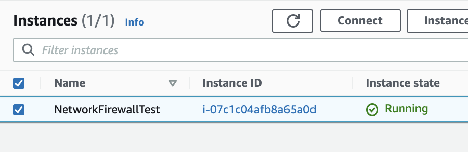
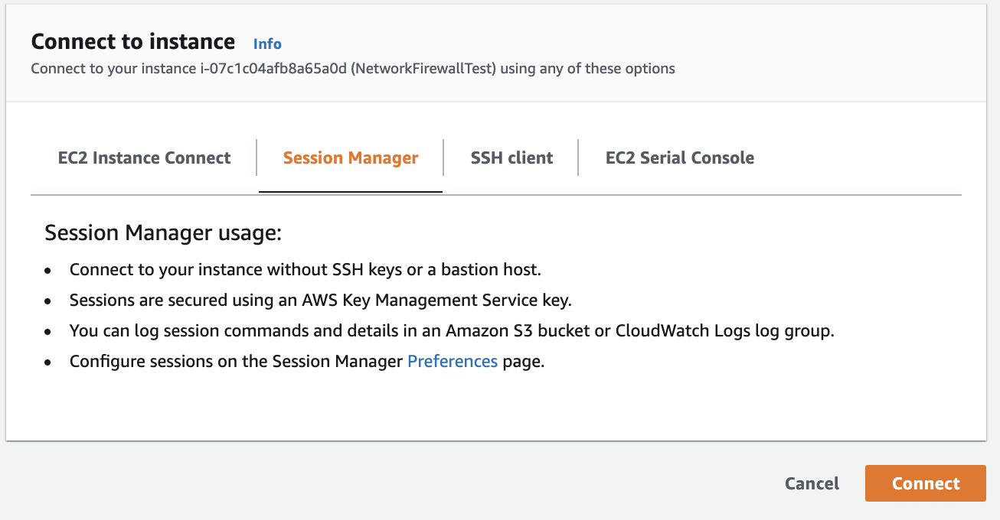

# Managed with domain filtering for outbound traffic from AWS VPC

## Overview
When running an application on a VPC, enterprise companies often filter outbound HTTP traffic as part of company's security measures. This is primarily to prevent applications from accessing malicious domains. 

Traditionally, customers have built proxy server to filter the outbound HTTP domains, however there were always two major problems.

1. Scalability  
   Outbound traffic used across the enterprise requires wider bandwidth and proxy servers.
2. Application compatibility  
   As not all application allows users to specify proxy servers for outbound access, those "proxy-unaware" applications were not available in such network.

This sample demonstrates how the  

## Solution
With [AWS Network Firewall](https://aws.amazon.com/network-firewall/?nc1=h_ls&whats-new-cards.sort-by=item.additionalFields.postDateTime&whats-new-cards.sort-order=desc), customers can build managed domain filtering solution **without having any proxy servers**. Network Firewall allows you to filter the outbound traffic from your VPC to unfavorable domains. Addition to the wider bandwidth, it provides application transparent domain filtering, where applications are no longer required to configure any explicit proxy servers.

*Looking for advanced AWS Network Firewall Sample, with AWS Transit Gateway? Well, Please take a look [this example](https://github.com/aws-samples/aws-network-firewall-terraform).*

## Architecture


## Quick Starts
This solution is build on top of [Terraform](https://www.terraform.io/), so you need to have some familiarity to deploy it.

1. Get AWS Account
2. Setup IAM user and access, secret keys
3. Install [tfenv](https://github.com/tfutils/tfenv)
4. Install terraform cli tool version `0.14.7` or above, via tfevn
   ```bash
   tfenv install 0.14.7
   ```
5. set Terraform version
   ```bash
   tfenv use 0.14.7
   ```
6. Configure your Terraform state backend  
   In order to make the deployment stable, it is highly recommend to store your Terraform state file in Amazon S3, or equivalent cloud storage. In `envs/dev/backend.tf` file, you can specify your own amazon S3 bucket.
   ```HCL
    terraform {
        backend "s3" {
            bucket = "<YOUR OWN S3 BUCKET NAME>"
            key    = "<STATE FILE NAME>"
            region = "<S3 REGION>"
        }
    }   
   ```
7. Configure your the AWS region code (eg, us-east-1) to deploy  
   In `envs/dev/provider.tf` file, 
   ```HCL
   provider "aws" {
      region = "<YOUR REGION TO DEPLOY>"
   }
   ```   
     
8. Initialize Terraform  
   ```bash
   cd envs/dev
   terraform init
   ```
9.  Configure **Allowed Domain List**  
   In `envs/dev`, you will see `allowed_domains.yml` file. This file is the list to which the application on private subnet to access. You can add, delete the domain list as you want.   
   `IMPORTANT`
   This solution is basically "Allowed List", so the domains that is not on the `allowed_domains.yml`, they are going to be `DENIED`.
10. Deploy it.
    ```bash
    terraform apply
    ```

## How to play
Now you have already deploy the infrastructure stack in your environment. Now it's time to play with it!

The test EC2 instance needs to be created in private subnet. However The private subnet doesn't have any internet facing network, you need to use [AWS Systems Manager (AWS SSM) Session Manager](https://docs.aws.amazon.com/systems-manager/latest/userguide/session-manager.html). AWS SSM Session Manager allows you to jump in to the EC2 instance without accessing actual EC2 instance IP address. In order to create test instance please follow the steps below.  

1. Create Amazon EC2 instance in *private subnet*  
   1. Create EC2 IAM Role with *AmazonSSMManagedInstanceCore* IAM Policy.
   2. Create Amazon EC2 Instance with the latest version of Amazon Linux 2. (AWS SSM Agent is already installed in Amazon Linux 2)
   3. Make sure attaching the EC2 IAM Role to the instance you created. 

2. Jump in to the EC2 instance with AWS SSM Session Manager 
    
   Once your EC2 instance started, you should be able to see the `Connect` for Session Manager button activated in Management Console. 

   

   

   Clicking `Connect` button, you can jump in to the EC2 instance console from your browser.


3. Test it if the HTTP domain filtering is actually blocked.  
   
   Now you have access the test instance. By default, in the `allowed_domains.yml` there is a single line `.amazon.com`. This means "Only the outbound HTTPS traffic toward *.amazon.com can go through". Now let's see if it works as we expected. 

   1. Network filtering test.

   ```
   curl https://www.amazon.com
   ```

   You will see some HTML contents returned. Now let's try another domain that is not on the `allowed_domains.yml`. 

   ```
   curl https://www.google.com
   ```

   At this time, you will have no response. But you may be wondering is this really the result of AWS Network Firewall filtering traffic? Did something else just drop the packet? Well, Let's confirm that.

   1. Check the CloudWatch Logs

   In order to check if it works as we expected, In the CloudWatch Logs console, there will be log groups named `firewall_alert_logs`. In the log group, you will see the log message in the latest log stream. 

   ```json
   {
      "firewall_name": "network-firewall",
      "availability_zone": "ap-northeast-1c",
      "event_timestamp": "1631177288",
      "event": {
         "timestamp": "2021-09-09T08:48:08.126655+0000",
         "flow_id": 1019585680161813,
         "event_type": "alert",
         "src_ip": "10.0.2.182",
         "src_port": 59601,
         "dest_ip": "172.217.26.4",
         "dest_port": 443,
         "proto": "TCP",
         "alert": {
               "action": "blocked",
               "signature_id": 4,
               "rev": 1,
               "signature": "not matching any TLS allowlisted FQDNs",
               "category": "",
               "severity": 1
         },
         "tls": {
               "sni": "www.google.com",
               "version": "UNDETERMINED",
               "ja3": {},
               "ja3s": {}
         },
         "app_proto": "tls"
      }
   }
   ```

   As you can see, the log clearly stated that the domain we tried to access (www.google.com) was not allowed to access.  


# Parameters for each components

Please follow Input and Output following.

## `main.tf` 

<details>

### Variables

| Variable | Type | Description |
| ------------- | ------------- | ------------- |
| vpc_cidr_block  | `String`  | Automatically create `/24` subnets in the VPC, so please specify larger CIDR range.  |

### Outputs

| Output | Type | Description |
| ------------- | ------------- | ------------- |
| igw  | `String`  | Internet Gateway (IGW) ID. |
| firewall_subnet_1_id  | `String`  | Firewall subnet ID located in first availability zone. |
| firewall_subnet_2_id  | `String`  | Firewall subnet ID located in second availability zone. |
| public_subnet_1_id  | `String`  | Public subnet ID located in first available zone. |
| public_subnet_2_id  | `String`  | Public subnet ID located in second available zone. |
| public_subnet_1_route_table_id  | `String`  | Route table ID for public subnet ID located in first available zone. |
| public_subnet_2_route_table_id  | `String`  | Route table ID for public subnet ID located in second available zone. |

</details>

## `modules/*`

### VPC
[vpc](./modules/vpc)

### Network Firewall
[network_firewall_with_nat](./modules/network_firewall_with_nat)

## Solution Specific Resources

### Firewall Gateway
Firewall gateway is a gateway that handle the traffic. It's pretty unique so if you want to more dive deep you should check [this blog](https://aws.amazon.com/jp/blogs/aws/aws-network-firewall-new-managed-firewall-service-in-vpc/).

### SSM Endpoints
Why is here? Because it prevent from being disconnected from your EC2 located on private subnet.   
If you added some domain related to AWS endpoint in `allowed_domains.yml`, what would happened? You would lose your connection to your app because Firewall Gateway would block the traffic too. In order to prevent this situation, SSM endpoints allow your to bypass Network firewall, so you can keep your connection whatever you did wrong. 